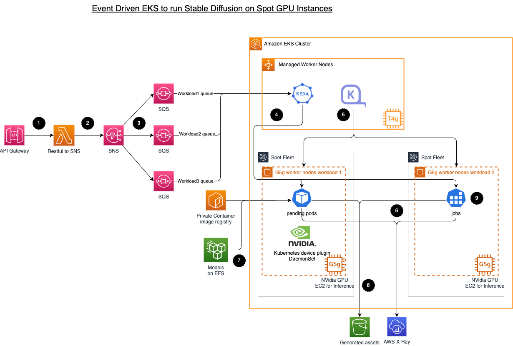

# Infrastructure for Running Stable Diffusion On-Demand Workloads

This repository contains infrastructure as code (IaC) using CDK to set up a robust and scalable environment for running stable diffusion workloads on-demand. The infrastructure is designed to efficiently handle workload submissions through an API gateway, manage message routing using Amazon Simple Notification Service (SNS) and Amazon Simple Queue Service (SQS), scale resources dynamically with Kubernetes Event Driven Autoscaling (KEDA), and provision GPU worker nodes on-demand using NVIDIA Bottlerocket and Karpenter provisioner.

## Architecture Overview



The infrastructure follows an event-driven architecture, where user-submitted stable diffusion workloads are processed through the following steps:

1. Users submit stable diffusion workloads through an API gateway.
2. A Lambda function backed by the API gateway posts the message to Amazon Simple Notification Service (SNS).
3. SNS routes the message to different Amazon Simple Queue Service (SQS) queues based on subscription filtering.
4. Kubernetes Event Driven Autoscaling (KEDA) listens to the respective queues and scales up the appropriate resources (ScaledObject or ScaledJob) based on workload demands.
5. When a pod is pending, the Karpenter provisioner provisions GPU worker nodes using Spot instances with NVIDIA Bottlerocket, pre-installed with the GPU driver.
6. Each pod consists of three containers: the queue manager, the stable diffusion API endpoint, and an AWS X-Ray sidecar for monitoring.
7. The models are hosted in Amazon Elastic File System (EFS) and shared with the pods using ReadWriteMany (RWX) Persistent Volume Claims (PVC). Note: ReadOnlyMany (ROX) is not supported by EFS CSI yet.
8. Once a health check on the stable diffusion API is successful, the queue manager triggers the stable diffusion API, waits for a response, and writes the result into Amazon S3.
9. If the workload is handled by a ScaledJob, the queue manager sends a stop API request to the Stable Diffusion API and sends a SIGTERM signal to the X-ray sidecar to mark the job as complete.

## Repository Structure

### CDK stacks

```
.  
├── bin  
├── lib
│   ├── addons
│   ├── resourceProvier
│   ├── runtime
│   │   └── sdRuntime.ts    # Generates the HELM values
│   ├── utils
│   └── dataPlane.ts        # The stack with EKS Blueprint
├── config.js               # configuration for your stack
└── ...
```

### The application

```
.  
├── src
│   └── backend
│   │   ├── queue_agent     # Queue manager for ScaledObject
│   │   ├── queue_job       # Queue manager for ScaledJob that kills other container upon job completion
│   │   └── sd_webui_api    # Cloned with modification from https://github.com/antman2008/stable-diffusion-webui-dockerfile
│   ├── charts 
|   │   └── charts 
|   |       └── eks-keda-sd
│   └── frontend
|       └── input_function
|           └── app.py
└── ...
```

## How to Use

1. Clone this repository:

```bash
git clone --recurse-submodules https://github.com/your-username/your-repo.git
```
### Build the images

Build the 3 container images in the `src/backend` folder and push to ECR.

### Build the snapsho

In the `scripts/bottlrocket-images-cache` folder, runs the `snapshot.sh` with the 3 images as the runtime parameers separated by commas.

Copy the `snapshotId` and update the `config.js`

### CDK deploy

2. Configure `config.js` according to your environment and run `cdk deploy` from the root folder.

3. Monitor and manage your stable diffusion workloads through the Kubernetes dashboard or CLI tools.

## How to test

1. CDK will show Outputs upon completion as follow:

```
Outputs:
<stack name>.ConfigCommand = 
<stack name>.FrontApiEndpoint = 
<stack name>.GetAPIKeyCommand = 
```

2. use `curl` to post a test data to `<stack name>.FrontApiEndpoint` with the API key obtained from `<stack name>.GetAPIKeyCommand`, for example:

```
curl -X POST <value of <stack name>.FrontApiEndpoint> \
    -H 'Content-Type: application/json' \
    -H 'x-api-key: <value of <stack name>.GetAPIKeyCommand>>' \
    --data-raw '
{
    "sdname": "sdruntime-jobAddon",
    "alwayson_scripts": {
      "task": "text-to-image",
      "sd_model_checkpoint": "v1-5-pruned-emaonly.safetensors",
      "id_task": "307"
    },
    "prompt": "Renaissance-style portrait of an astronaut in space, detailed starry background, reflective helmet.",
    "steps": 16,
    "width": 512,
    "height": 512
}'
```

3. The output can be found in the S3 bucket once the job completed.


## GPU slicing

The [lib/addons/nvidiaDevicePlugin.ts](lib/addons/nvidiaDevicePlugin.ts) added the capability of [time slicing](https://docs.nvidia.com/datacenter/cloud-native/gpu-operator/latest/gpu-sharing.html). 

1. Change the Deployment scale to 1 to trigger Karpenter to provision a GPU node.
```
% kubectl get pod -n sdruntime -o json | jq '.items[] | { nodename: .spec.nodeName, pod: .metadata.name}'
{
  "nodename": "ip-10-0-148-61.ec2.internal",
  "pod": "sdruntime-snapshot-eks-keda-sd-sd-webui-inference-api-8f68pxgw2"
}
```

2. Verify that nvidia device plugin is running on the new node

```
kubectl get pod -n nvidia-device-plugin -o json | jq '.items[] | { nodename: .spec.nodeName, pod: .metadata.name}'
 
{
  "nodename": "ip-10-0-148-61.ec2.internal",
  "pod": "nvdp-nvidia-device-plugin-2n724"
}
```

3. Check that GPU reported as per the `replicas` 

```
% kubectl get nodes -o json | jq -r '.items[] | select(.status.capacity."nvidia.com/gpu" != null) | {name: .metadata.name, capacity: .status.capacity}'

{
  "name": "ip-10-0-148-61.ec2.internal",
  "capacity": {
    "cpu": "4",
    "ephemeral-storage": "961944884Ki",
    "hugepages-1Gi": "0",
    "hugepages-2Mi": "0",
    "memory": "16049184Ki",
    "nvidia.com/gpu": "4",
    "pods": "29"
  }
}
```

4. Let's try to scale the service to 4

```
% kubectl scale -n sdruntime deployment <stack name>-sd-webui-inference-api --replicas=4                  
deployment.apps/sdruntime-snapshot-eks-keda-sd-sd-webui-inference-api scaled
```

5. Do we get to see all 4 pods running on the same node? Let's check

```
% kubectl get pod -n sdruntime -o json | jq '.items[] | { nodename: .spec.nodeName, pod: .metadata.name}'            
{
  "nodename": "ip-10-0-147-33.ec2.internal",
  "pod": "sdruntime-snapshot-eks-keda-sd-sd-webui-inference-api-8f682cpmc"
}
{
  "nodename": "ip-10-0-148-61.ec2.internal",
  "pod": "sdruntime-snapshot-eks-keda-sd-sd-webui-inference-api-8f682d9c6"
}
{
  "nodename": "ip-10-0-148-61.ec2.internal",
  "pod": "sdruntime-snapshot-eks-keda-sd-sd-webui-inference-api-8f685fgr4"
}
{
  "nodename": "ip-10-0-148-61.ec2.internal",
  "pod": "sdruntime-snapshot-eks-keda-sd-sd-webui-inference-api-8f68pxgw2"
}
```

6. Two Karpenter machines created

```
% kubectl get machines
NAME            TYPE          ZONE         NODE                           READY   AGE
default-7ztsq   g4dn.xlarge   us-east-1b   ip-10-0-148-61.ec2.internal    True    49m
default-j2qh2   g4dn.xlarge   us-east-1b   ip-10-0-138-235.ec2.internal   True    3m37s
```

7. Apparently a new node created to run the 4th pod, reason being, each pod requires 1 CPU and given that the node has only 4 CPUs, therefore the 4th runtime needs a new node.

8. Let's terminate one of the sdruntime and we should expect that the node with only 1 runtime pod to be terminated

```
% kubectl get pod -n sdruntime -o json | jq '.items[] | { nodename: .spec.nodeName, pod: .metadata.name}'
{
  "nodename": "ip-10-0-148-61.ec2.internal",
  "pod": "sdruntime-snapshot-eks-keda-sd-sd-webui-inference-api-8f682cvf9"
}
{
  "nodename": "ip-10-0-148-61.ec2.internal",
  "pod": "sdruntime-snapshot-eks-keda-sd-sd-webui-inference-api-8f685fgr4"
}
{
  "nodename": "ip-10-0-148-61.ec2.internal",
  "pod": "sdruntime-snapshot-eks-keda-sd-sd-webui-inference-api-8f68pxgw2"
}
% kubectl get machines
NAME            TYPE          ZONE         NODE                          READY   AGE
default-7ztsq   g4dn.xlarge   us-east-1b   ip-10-0-148-61.ec2.internal   True    53m
```

## License

This project is licensed under the [MIT License](LICENSE).

# Credits

*  The Stable Diffusion engine and the queue agent are from the awesome work by [于昺蛟](https://github.com/yubingjiaocn) in [Stable Diffusion on EKS](https://aws.amazon.com/cn/blogs/china/stable-diffusion-image-generation-solution-based-on-amazon-eks/).
* [Dockerfile for the Stable Diffusion WebUI](https://github.com/antman2008/stable-diffusion-webui-dockerfile)
* [AUTOMATIC111 web UI](https://github.com/AUTOMATIC1111/stable-diffusion-webui)